# PostProcessing Toolbox

**Land cover post-processing suite for semantic segmentation outputs in ArcGIS Pro**

[](LICENSE)
[](https://www.esri.com/en-us/arcgis/products/arcgis-pro)
[](https://www.python.org/)

A modular Python Toolbox (`.pyt`) for ArcGIS Pro that converts raw pixel-level classification rasters into clean, attributed vector features. Designed for drone imagery captured with the **MicaSense Altum-PT** multispectral sensor and classified using **DeepLabV3 + PointRend** (ResNet-101 backbone).

Four specialized tools share a common raster-to-vector pipeline and add domain-specific refinement for each land cover class:

| Tool | Phase 4 (Shape) | Phase 7 (Classification) | Extras |
|------|-----------------|--------------------------|--------|
| **Vehicle** | SimplifyPolygon | Area + L/W ratio | — |
| **Building** | RegularizeBuildingFootprint | Area + nDSM min height | Right angles enforcement |
| **Tree** | SmoothPolygon (PAEK) | Area + nDSM min height | Watershed / Grid crown separation |
| **Road** | Simplify + Dissolve | nDSM ceiling + MBR dims | Voronoi medial axis centerlines |

---

## Architecture

```
PostProcessing.pyt              ← UI + parameter logic (all 4 tools)
_postproc_common.py             ← shared pipeline phases (0-3, 5-6, 8)
_vehicle_core.py                ← vehicle-specific phases (4, 7)
_building_core.py               ← building-specific phases (4, 7)
_tree_core.py                   ← tree-specific phases (4, 4.5, 7)
_road_core.py                   ← road-specific phases (4a, 7, 7.5)
```

**Shared pipeline** (every tool runs these):

| Phase | Function | Description |
|-------|----------|-------------|
| 0 | `validate_inputs` | CRS check, cell size resolution, AOI extent, spatial overlap |
| 1 | `extract_class_pixels` | `Con(VALUE = target, 1, 0)` binary raster |
| 2 | `run_majority_filter` | Salt-and-pepper noise removal (FOUR/EIGHT/Skip) |
| 3 | `vectorize_binary` | `RasterToPolygon`, NO_SIMPLIFY, SINGLE_OUTER_PART |
| 5 | `compute_geometry_mbr` | Area, Perimeter, MBR Length/Width/Azimuth, L/W ratio |
| 6 | `enrich_attributes` | Sequential ID, Compactness, ZonalStats (nDSM + thermal) |
| 8 | `export_results` | CopyFeatures, centroids, JSON log, summary statistics |


---

## Interactive Documentation

Explore the pipeline visually with interactive HTML guides:

- **[Toolbox Overview Guide](https://nickkoro21.github.io/PostProcessing-Toolbox/toolbox-guide.html)** — All 4 tools, shared pipeline, deep-dives into Watershed, Grid, and Voronoi
- **[Vehicle Pipeline Animation](https://nickkoro21.github.io/PostProcessing-Toolbox/vehicle-pipeline.html)** — Step-by-step vehicle detection
- **[Building Pipeline Animation](https://nickkoro21.github.io/PostProcessing-Toolbox/building-pipeline.html)** — Building footprint regularization
- **[Tree Pipeline Animation](https://nickkoro21.github.io/PostProcessing-Toolbox/tree-pipeline.html)** — Crown separation with Watershed
- **[Road Pipeline Animation](https://nickkoro21.github.io/PostProcessing-Toolbox/road-pipeline.html)** — Road network + Voronoi centerlines

---

## Results

### Vehicle Analysis
| Tool Dialog | Detection Results | Classification |
|:-----------:|:-----------------:|:--------------:|
| 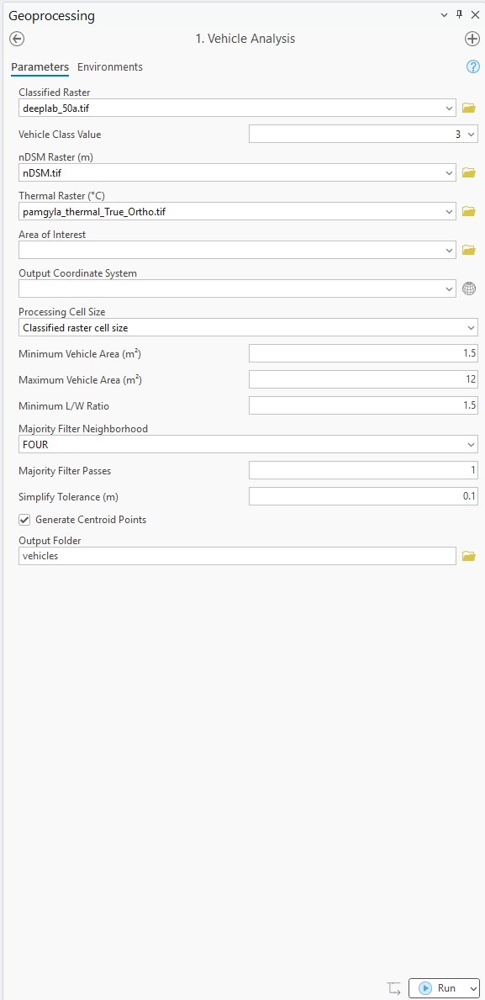 | 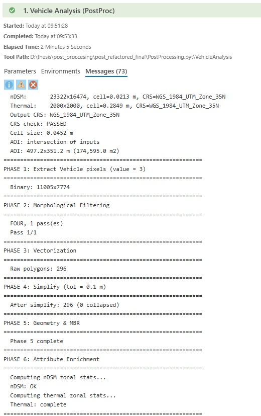 | 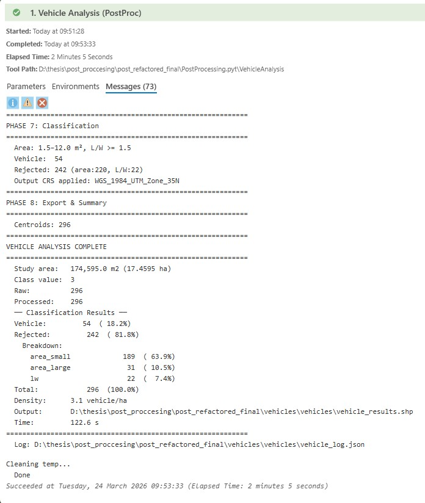 |

### Building Analysis
| Tool Dialog | Regularized Footprints | Classification |
|:-----------:|:---------------------:|:--------------:|
| 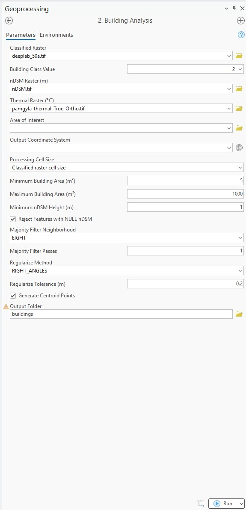 | 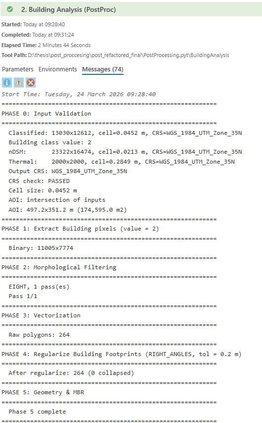 | 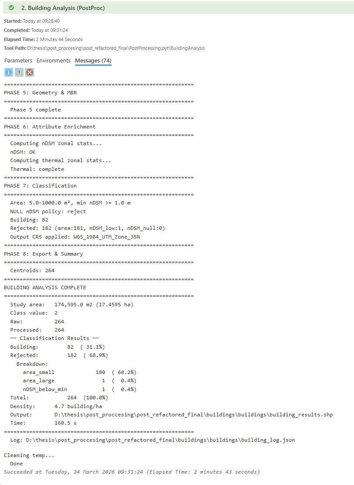 |

### Tree Analysis
| Tool Dialog | Crown Detection | Classification |
|:-----------:|:---------------:|:--------------:|
| 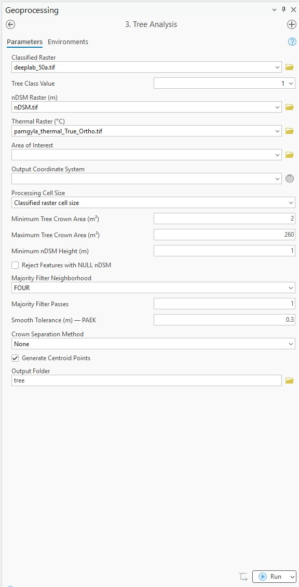 | 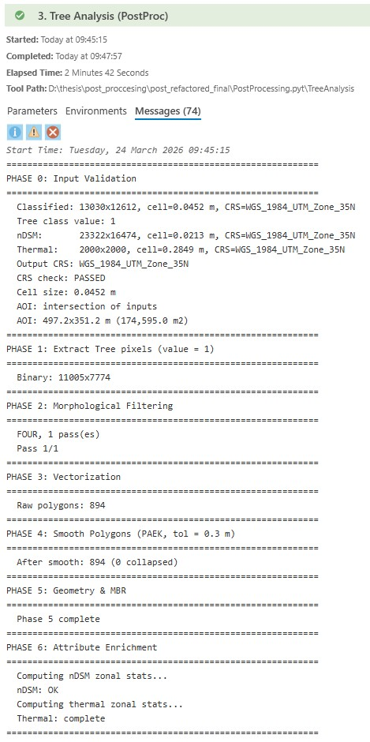 | 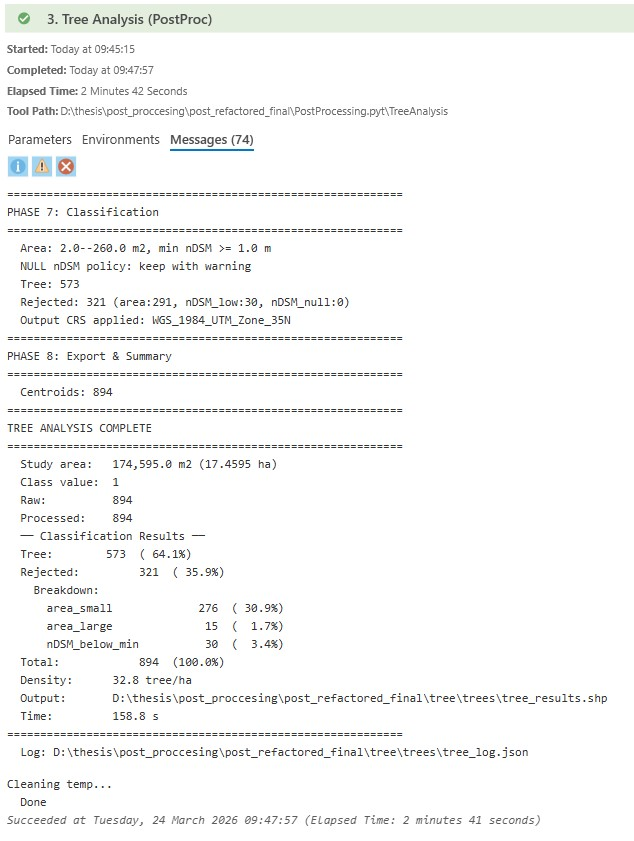 |

### Road Analysis
| Tool Dialog | Road Network | Centerlines |
|:-----------:|:------------:|:-----------:|
| 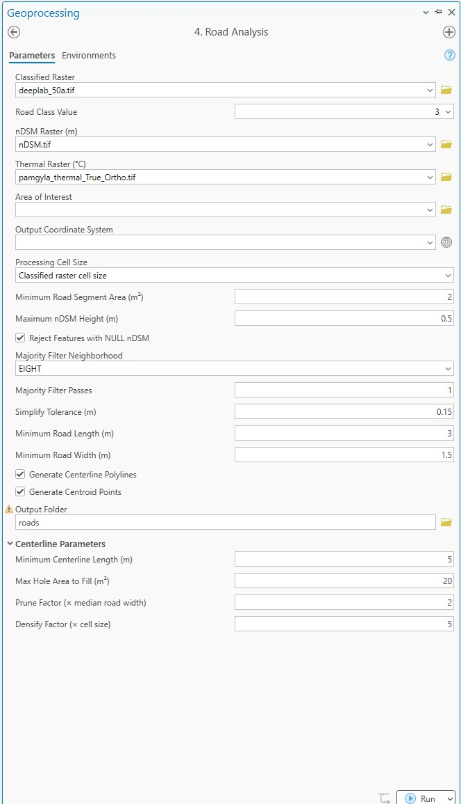 | 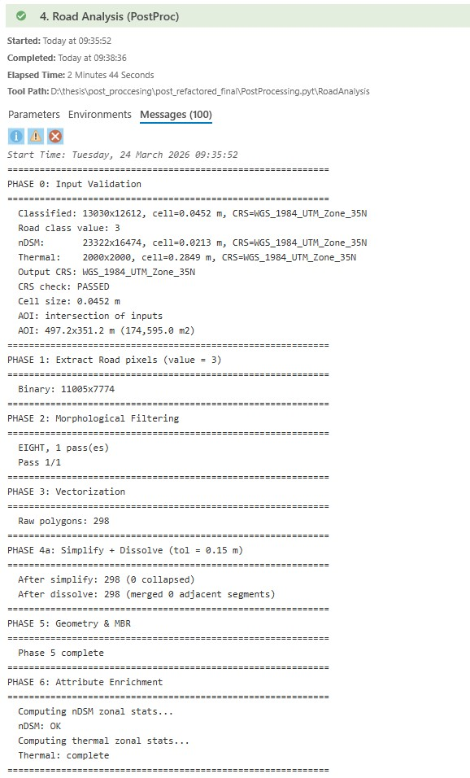 | 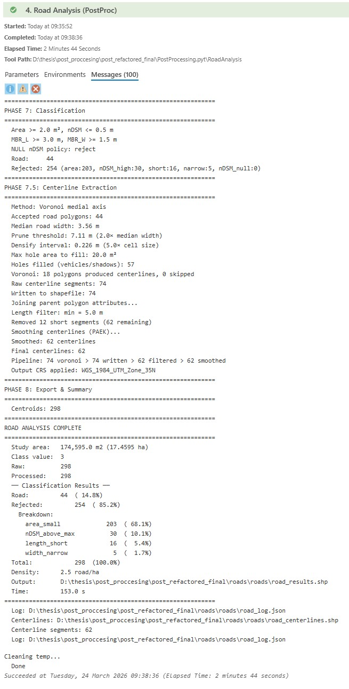 |

---

## Installation

### Requirements

- **ArcGIS Pro 3.6+** with Python 3.11+
- **Spatial Analyst** extension (required)
- **3D Analyst** extension (required)
- For Voronoi centerlines (optional): `shapely >= 2.0`, `scipy`, `networkx`, `numpy`

### Setup

1. Download or clone this repository:
   ```bash
   git clone https://github.com/Nickkoro21/PostProcessing-Toolbox.git
   ```

2. Copy the `toolbox/` folder contents to your ArcGIS Pro project directory (next to your `.aprx` file):
   ```
   your_project/
   ├── your_project.aprx
   ├── PostProcessing.pyt
   ├── _postproc_common.py
   ├── _vehicle_core.py
   ├── _building_core.py
   ├── _tree_core.py
   ├── _road_core.py
   └── PostProcessing.*.pyt.xml  (5 metadata files)
   ```

3. In ArcGIS Pro, right-click in the Catalog pane → **Add Toolbox** → navigate to `PostProcessing.pyt`.

4. The toolbox appears with 4 tools organized by category (Vehicle, Building, Tree, Road).

### Optional: Voronoi Centerlines

The Road Analysis tool uses Voronoi medial axis centerlines for high-quality road network extraction. If the dependencies are not installed, it falls back to morphological Thin (lower quality).

To install in ArcGIS Pro's Python environment:
```bash
# Open ArcGIS Pro Python Command Prompt
pip install shapely scipy networkx
```

---

## Usage

### Quick Start

1. Open any of the 4 tools from the Catalog pane
2. Select your **classified raster** (single-band, integer classes)
3. Pick the **class value** from the auto-populated dropdown
4. Provide the **nDSM raster** (height above ground in meters)
5. Choose an **output folder**
6. Click **Run**

### Inputs

| Input | Type | Description |
|-------|------|-------------|
| Classified Raster | Required | Single-band integer raster from DeepLabV3/PointRend |
| Class Value | Required | Target class (auto-detected from raster) |
| nDSM Raster | Required | Normalized Digital Surface Model (meters) |
| Thermal Raster | Optional | Temperature in °C (MicaSense Altum-PT LWIR) |
| Area of Interest | Optional | Polygon or raster mask |
| Output CRS | Optional | Defaults to classified raster CRS |

### Outputs

Each tool creates a subfolder (`vehicles/`, `buildings/`, `trees/`, `roads/`) containing:

| Output | Format | Description |
|--------|--------|-------------|
| `*_results.shp` | Polygon | All features with `Class` and `Reason` fields |
| `*_points.shp` | Point | Centroid of each feature (optional) |
| `*_centerlines.shp` | Polyline | Road centerlines only (Road tool) |
| `*_log.json` | JSON | Full run parameters, statistics, timing |

### Output Fields

All tools produce these attribute fields:

| Field | Type | Description |
|-------|------|-------------|
| `*ID` | Long | Sequential identifier (VehicleID, BuildingID, etc.) |
| `Area_m2` | Double | Polygon area in square meters |
| `Perim_m` | Double | Perimeter in meters |
| `MBR_W` | Double | Minimum Bounding Rectangle width (m) |
| `MBR_L` | Double | MBR length (m) |
| `MBR_Azim` | Double | MBR orientation (degrees) |
| `LW_Ratio` | Double | Length/Width ratio |
| `Compact` | Double | Polsby-Popper compactness (0-1) |
| `MEAN_nDSM` | Double | Mean height above ground (m) |
| `MEAN_Therm` | Double | Mean thermal temperature (°C) |
| `Class` | Text | Accepted class or "Rejected possible *" |
| `Reason` | Text | Rejection reason or empty |

---

## Key Algorithms

### Voronoi Medial Axis Centerlines (Road Tool)

The road centerline extraction uses a Voronoi diagram approach:

1. **Fill holes** — Remove small interior holes (vehicles, shadows) below configurable area threshold
2. **Densify boundary** — Sample polygon boundary at regular intervals
3. **Voronoi diagram** — Compute using `scipy.spatial.Voronoi`
4. **Interior filtering** — Retain only edges fully inside the polygon (the medial axis)
5. **Graph pruning** — Iteratively remove terminal branches shorter than `prune_factor × median_road_width` using `networkx`
6. **Line merge** — Combine surviving edges via `shapely.ops.linemerge`
7. **Smooth** — PAEK smoothing for cartographic quality

### Watershed Crown Separation (Tree Tool)

For separating merged tree canopies:

1. **Filter by area** — Only polygons above threshold (default 120 m²) are processed
2. **nDSM local maxima** — Detect peaks with prominence filter (≥ 2 m above local minimum)
3. **Marker-controlled Watershed** — FlowDirection + Watershed using detected peaks as seeds
4. **Selective splitting** — Only polygons with 3+ detected peaks are split; others stay intact
5. **Area preservation** — Split pieces clipped to original polygon boundary

---

## Technical Notes

- **CRS handling**: Output CRS is applied only after all raster operations (phases 1-3) to prevent "no valid statistics" errors during on-the-fly reprojection
- **NoData exclusion**: Class 0 and NoData pixels are excluded throughout the pipeline
- **Memory management**: Zonal statistics use a safe join pattern to handle field name collisions between nDSM and thermal joins
- **Geographic CRS warning**: If the output CRS uses degrees (not meters), a warning is issued since area/length calculations will be incorrect
- **Environment cleanup**: All arcpy environment settings (cellSize, extent, mask, outputCoordinateSystem) are reset after each tool run

---

## Citation

If you use this toolbox in your research, please cite:

```
Koroniadis, N. (2026). PostProcessing Toolbox: Land cover post-processing suite 
for semantic segmentation of multispectral drone imagery. MSc Thesis, 
Department of Geography, University of the Aegean.
```

---

## Author

**Nikolaos Koroniadis**  
MSc Geography and Applied Geoinformatics  
University of the Aegean  
[Remote Sensing & GIS Research Group](https://rsgis.aegean.gr/)

---

## License

This project is licensed under the MIT License — see the [LICENSE](LICENSE) file for details.
